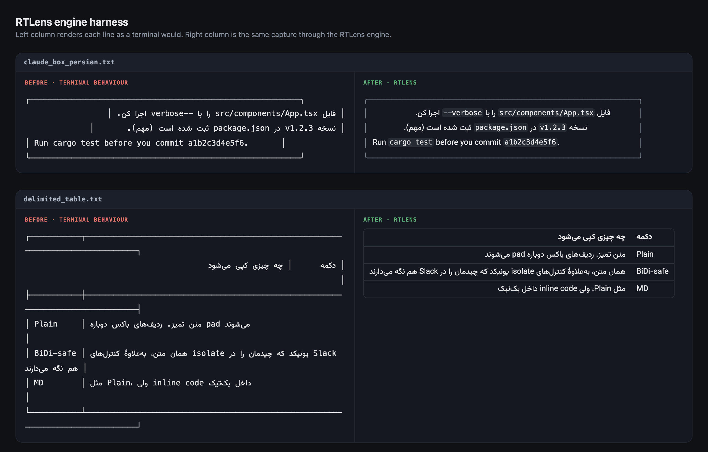

# RTLens

**RTLens fixes broken Persian (Farsi) and mixed right-to-left (RTL/BiDi) terminal output.**
Select text, press a hotkey, and read paths, wrapped lines, and tables in the correct order.
Available for macOS now; Windows and Linux builds are planned. [Download the latest release](https://github.com/hesamkaveh/RTLens/releases/latest).

[](https://github.com/hesamkaveh/RTLens/actions/workflows/ci.yml)
[](LICENSE)




<sub>Left is what a terminal does with the capture. Right is the same bytes through RTLens.
Both columns use the HUD's own stylesheet — regenerate this with `pnpm harness`.</sub>

## The problem

Terminal emulators run the Unicode bidi algorithm per *visual line*, with no notion of the
structure around the text. Persian output from CLI tools comes out broken in four recurring
ways, and RTLens fixes each one:

| Symptom | Cause | Fix |
| --- | --- | --- |
| Box frames shatter — `│ متن │` puts its borders in the wrong places | `│` is a neutral character, so it gets swept into the RTL run the first Persian letter starts | The frame is split out of the directional content and laid out physically |
| `--flag`, `/src/path.rs`, `(...)` drag their punctuation to the far side of the line | Neutrals at a direction boundary resolve against the paragraph, not the token | Structured tokens are wrapped in `unicode-bidi: isolate`, with trailing punctuation pushed back out |
| One Persian sentence zig-zags across several lines | The terminal hard-wraps, then each fragment resolves its own direction and alignment | Wrapped fragments are rejoined before layout |
| A table's columns swap places and its rows come apart | A row is one paragraph, so a Persian cell reorders the Latin cell beside it; a cell too wide for its column was wrapped, and the continuation line has no first column at all | The columns are recovered from the screen geometry, each cell becomes its own paragraph, and a wrapped fragment rejoins inside the cell it belongs to |

Nothing is retyped or translated. The bytes are the bytes you captured; only their
structure is made explicit.

## Install

Download `RTLens_<version>_universal.dmg` from the [latest
release](https://github.com/hesamkaveh/RTLens/releases/latest) — one universal build for
Apple Silicon and Intel, macOS 11 or newer — and drag it to Applications.

The build is code-signed by the release workflow but is not notarised with Apple, so
Gatekeeper may block the first launch. Open it once from the context menu — **right-click
RTLens.app → Open → Open** — or clear the quarantine flag yourself:

```sh
xattr -dr com.apple.quarantine /Applications/RTLens.app
```

Then grant [Accessibility access](#permissions-macos); without it the hotkey fires but
captures nothing. There is no Windows or Linux build — see [Known limits](#known-limits).

Prefer to build it? See [Build](#build).

## Usage

Select text in any app, press the shortcut, and the HUD appears over what you were doing.

| Key | Action |
| --- | --- |
| `⌃⌥R` on macOS, `Ctrl+Alt+R` on Windows/Linux (default) | Capture the selection and show the HUD; press again to dismiss |
| `Esc` | Dismiss |

The default is deliberately not `⌘⇧R`: a global shortcut outranks application shortcuts, so
binding that would disable hard-reload in every browser for as long as RTLens is running.

With nothing selected, RTLens can show what is already on the clipboard. Turn that off and
you get an empty state instead.

The tray menu holds *Capture Now*, *Settings…*, *Launch at Login* and *Quit*. Settings
covers the global shortcut, font size, whether the HUD closes when it
loses focus, and the three engine toggles — rejoin wrapped lines, fold Arabic letterforms
onto their Persian equivalents, and render inline code as a chip instead of literal
backticks. All three are on by default.

## How it works

RTLens does not implement bidi. It restructures text so the webview's own
(HarfBuzz-backed) implementation can get it right — which is why this is a webview app and
not a native-toolkit one.

```
hotkey ─▶ capture ─▶ sanitize ─▶ gutter split ─▶ direction ─▶ tables ─▶ unwrap ─▶ segment ─▶ HUD
```

Stage order is load-bearing. Tables are recovered before unwrap, or unwrap would weld a
table row to the row beneath it; and before segmentation, because each cell is segmented on
its own. Nothing about a table is parsed as syntax — `│`-delimited output from a markdown
renderer and a whitespace-aligned report script have nothing in common except that *the
same screen columns stay free on every row*, and that invariant is the whole detector.

The engine lives in `crates/rtlens-core` and has no GUI or OS dependency at all, so it is
unit- and snapshot-tested headlessly. `src-tauri` is only the shell around it: hotkey,
capture, window, tray.

### Selection capture

GPU-accelerated terminals (Ghostty, Alacritty, WezTerm) render text themselves and expose
nothing useful through the accessibility APIs, so `AXSelectedText` returns nothing for
exactly the apps RTLens exists to serve. Instead:

1. Snapshot the pasteboard — **every type and its bytes**, not just text, so an image, RTF
   snippet or file URL you had copied survives.
2. Synthesise ⌘C into the frontmost app.
3. Poll `NSPasteboard.changeCount` (not a content hash — re-copying identical text still
   registers) until it moves, or 350 ms elapses.
4. Read the selection, then restore the snapshot — **unless** the pasteboard moved again,
   which would mean clobbering someone else's write.

If the pasteboard never changes there was no selection and ⌘C was a no-op, so nothing needs
restoring.

> On Windows and Linux the synthesised key is **`Ctrl+Shift+C`, never `Ctrl+C`**. With no
> active selection, terminals pass `Ctrl+C` to the foreground process as SIGINT — it would
> kill whatever the user is running. Under X11 the primary selection is read directly, so
> no synthetic input happens at all.

### Antigravity (experimental)

Turn on **Settings → Integrations → RTL in Antigravity** to lay out Persian and Arabic
correctly in the Antigravity app's agent chat, sidebar and prompt box. RTLens attaches to
Antigravity's windows through the Chrome DevTools Protocol and keeps working across
reloads and restarts for as long as RTLens is running. Antigravity must have remote
debugging enabled, and while that port is open **any local process can control the app**
— only turn it on on a machine you trust.

For development without the app, `pnpm antigravity` injects the same script
(`integrations/antigravity/client.cjs`) once and `pnpm antigravity:watch` stays attached.
`pnpm antigravity:install` runs that watcher at login as a launchd agent (remove it with
`pnpm antigravity:uninstall`); don't combine it with the app setting.

## Build

Requires Rust (stable), Node 20.19+ or 22.12+, and pnpm.

```sh
pnpm install
pnpm tauri dev          # run
pnpm tauri build        # bundle to target/release/bundle
```

> Build with `pnpm tauri build`, **not** bare `cargo build --release`. The Tauri CLI sets
> the environment that tells `tauri-build` this is a production build; without it the
> binary is still wired to `devUrl` and every window loads `about:blank` against a dev
> server that is not running. The failure looks like a broken app — a blank window, no
> logs, no IPC — rather than a build mistake.

If `cargo` is not on your PATH, `rustup` was installed with `--no-modify-path`; add it with
`. "$HOME/.cargo/env"` or append `$HOME/.cargo/bin` to your shell profile.

### Engine development

The engine needs no GUI and no permissions, so iterate on it directly:

```sh
cargo test -p rtlens-core                    # unit + snapshot tests
cargo insta review                           # accept snapshot changes

# Inspect any capture without building the app
pbpaste | cargo run -p rtlens-core --bin rtlens-dump -- --html > out.html
pbpaste | cargo run -p rtlens-core --bin rtlens-dump -- --copy bidi-safe

# Before/after comparison across every fixture
pnpm harness

# ...or just the cases you are working on
python3 scripts/build-harness.py claude_box_persian wrapped_prose
```

The harness renders each fixture twice — once the way a terminal would, once through
RTLens — using the *same* `src/styles/layout.css` the shipping HUD uses, so what you see
there is what the app does. It writes `target/harness.html`; open it in a browser.

CI gates on `pnpm check` (tsc + workspace clippy, warnings as errors), `cargo fmt
--all -- --check`, `pnpm test` (engine tests), and `pnpm test:hud`.

## Permissions (macOS)

RTLens needs **Accessibility** access to synthesise ⌘C: System Settings → Privacy &
Security → Accessibility. The settings window offers a button that opens the exact pane;
the HUD explains when the permission is missing.

macOS binds this grant to the app's code signature, so every `cargo build` during
development produces a new ad-hoc signature and macOS asks again. Sign dev builds with a
stable self-signed identity to avoid re-granting on every rebuild.

Nothing captured ever leaves the machine: RTLens makes no network requests, and its webview
is locked to a `default-src 'self'` CSP. [SECURITY.md](SECURITY.md) spells out exactly what
the permissions allow, and is where to report a vulnerability privately.

## Measured footprint

Production bundle, macOS 26.6 (arm64), HUD open with a document rendered:

| Metric | Value |
| --- | --- |
| Physical footprint (what Activity Monitor reports) | **25.9 MB** |
| Physical footprint, peak | 32.4 MB |
| Resident set size (RSS) | 93 MB |
| `RTLens.app` on disk | 6.3 MB |

RSS is the misleading number here — most of it is shared, read-only framework pages
(WebKit, AppKit) that every app on the system maps and which cost nothing extra. Physical
footprint is the figure to judge by, and it comes in under the 45 MB target.

Measure it yourself with `vmmap --summary $(pgrep -f RTLens.app) | grep footprint`.

## Known limits

- Clipboard managers (Raycast, Maccy, Paste) will record the transient copy. That is
  inherent to the technique; there is no way to copy without the clipboard noticing.
- **Windows and Linux are unverified.** They are written behind the same `Capturer` trait
  and are `cfg`-gated, but this build was developed on macOS only and those paths have
  never been compiled or run. Clipboard backup there covers text and images; matching the
  macOS all-types fidelity needs raw `EnumClipboardFormats` work that should not be written
  without hardware to test on.
- Wayland cannot reliably synthesise input without ydotool/uinput, so it falls back to
  primary selection or manual copy.

## Contributing

PRs are welcome — see [CONTRIBUTING.md](CONTRIBUTING.md) and the [code of
conduct](CODE_OF_CONDUCT.md). The engine (`crates/rtlens-core`) is the part that benefits
most: it is fully headless, so new fixtures and regression tests are cheap to add.

Found a capture RTLens gets wrong? [Open an
issue](https://github.com/hesamkaveh/RTLens/issues/new?template=broken-layout.yml) with the
*raw* text — before RTLens touched it. That is the one thing the bug cannot be diagnosed
without, and it becomes a fixture directly.

## License

MIT — see [LICENSE](LICENSE).

RTLens bundles two fonts, each under its own SIL Open Font License 1.1:

- JetBrains Mono — [license](src/assets/fonts/JetBrainsMono-LICENSE.txt)
- Vazirmatn — [license](src/assets/fonts/Vazirmatn-LICENSE.txt)
